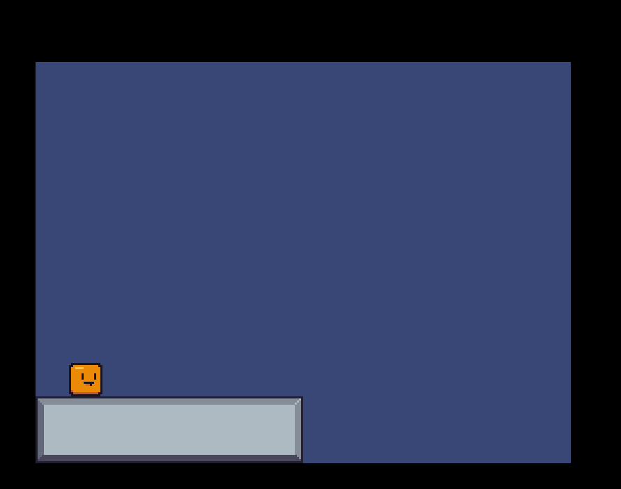

# GhostLight

A web based 2d scene editor.  
https://ghostlight.onrender.com

GhostLight is a level editor for 2D games that runs directly in your browser.
And that's not all – GhostLight allows you to directly link your local assets and stores levels as local JSON files.

Check out a demo game:  
[Play it online](https://ghostlight-excalibur-demo.onrender.com/)  
[Get the source code](https://github.com/simon-jaeger/ghostlight/tree/main/demos/excalibur-demo)
