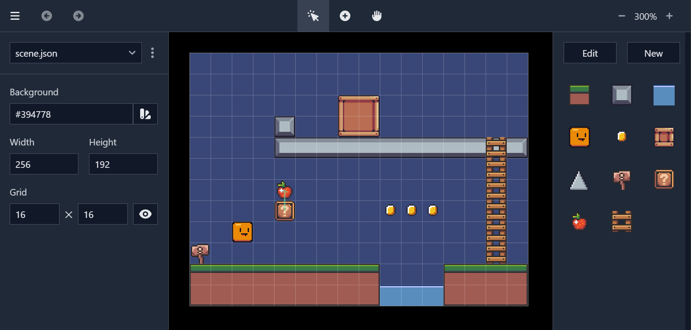

# GhostLight: Excalibur demo

A little demo game that utilizes the level editor
[GhostLight](https://github.com/simon-jaeger/GhostLight)
in combination with the game dev framework [Excalibur](https://excaliburjs.com/).

**Controls**  
Arrow keys to move, spacebar to jump.

[Play it now!](https://ghostlight-excalibur-demo.onrender.com/)

---

assets by:  
https://rottingpixels.itch.io/  
https://pixelfrog-assets.itch.io/  
https://grafxkid.itch.io/  
https://blackdragon1727.itch.io/  
