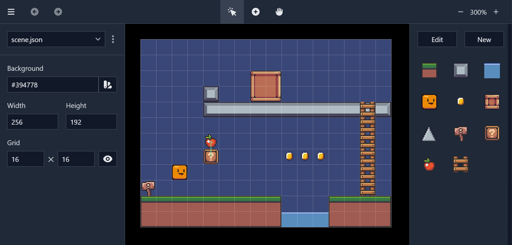
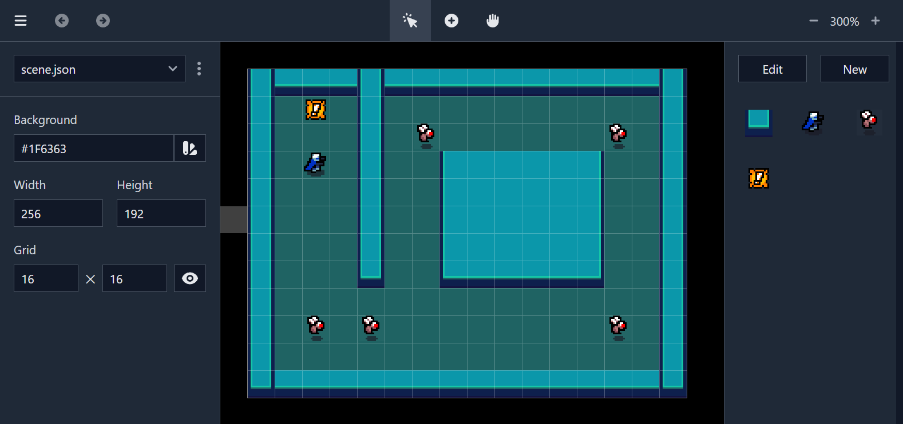

# Help

GhostLight is a web based editor for 2d scenes. To use it,
visit https://ghostlight.onrender.com with an up to date version of Google
Chrome.

[](https://www.youtube.com/watch?v=WMHZLPA_Cho) <br>
[→ Video tutorial on YouTube](https://www.youtube.com/watch?v=WMHZLPA_Cho)

## Demo games

| Platformer                                                          | Shooter                                                           |
|---------------------------------------------------------------------|-------------------------------------------------------------------|
|                                   |                                       |
| [Play](https://ghostlight-excalibur-demo.onrender.com/)             | [Play](https://ghostlight-shooter-demo.onrender.com/)             |
| [Source](https://github.com/simon-jaeger/ghostlight-excalibur-demo) | [Source](https://github.com/simon-jaeger/ghostlight-shooter-demo) |

## Community

Join the official [Discord server](https://www.youtube.com/redirect?event=video_description&redir_token=QUFFLUhqbHVWV2FHWVU4Z21fYWxlV2R5UDc1akxaNHUxZ3xBQ3Jtc0tuTWFoQ0JsUU5OUVU3ZVRKX00weU5wQy1kUGlLNl82MDZhakQ5elBZcFJkWE5CcWgzaEJ4RC1POGNzV0gyTGM4NXR6dVhiR0xESHRvbUNZWUt0dlJaRFRqZVlVNWhDR2F5dnJBajE3Y1luSlNkSEY3VQ&q=https%3A%2F%2Fdiscord.gg%2FSCMnEkcFYY)
to ask questions or show off your work. I'm looking forward to seeing you there!

## Keyboard controls

| Input                                               | Effect          |
|-----------------------------------------------------|-----------------|
| <kbd>Ctrl</kbd>+<kbd>A</kbd>                        | Select all      |
| <kbd>Ctrl</kbd>+<kbd>C</kbd>                        | Copy            |
| <kbd>Ctrl</kbd>+<kbd>X</kbd>                        | Cut             |
| <kbd>Ctrl</kbd>+<kbd>P</kbd>                        | Paste           |
| <kbd>Ctrl</kbd>+<kbd>Z</kbd>                        | Undo            |
| <kbd>Ctrl</kbd>+<kbd>Y</kbd>                        | Redo            |
| <kbd>Esc</kbd>                                      | Clear selection |
| <kbd>Delete</kbd>                                   | Delete selected |
| <kbd>Space</kbd>                                    | Pan camera      |
| <kbd>+</kbd>                                        | Zoom in         |
| <kbd>-</kbd>                                        | Zoom out        |
| <kbd>↑</kbd> <kbd>↓</kbd> <kbd>→</kbd> <kbd>←</kbd> | Move selected   |

## File structure

GhostLight stores data according to the following structure. When you update an
asset locally, it will automatically be hot reloaded.

```sh

your-project
`-- .ghostlight/
    |-- assets/
    |   |-- linked.png
    |   `-- assets.png
    |-- scenes/
    |   |-- scene-01.json
    |   `-- scene-02.json
    `-- types/
        `-- types.json
```

## File interface

Each scene file implements the following interface.

```ts
interface glScene {
  config: {
    background: string
    width: number
    height: number
  }
  actors: {
    id: string
    type_id: string
    type: string
    texture: string
    resize: "Disable" | "Scale" | "Repeat" | "Slice"
    x: number
    y: number
    width: number
    height: number
    props: { [key: string]: any }
  }[]
}
```
